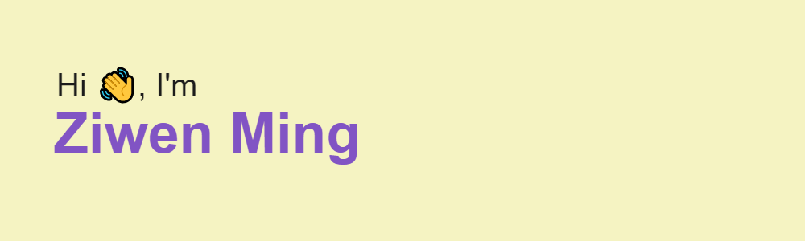

<!---

  

 --->

-----

### :woman_technologist: About Me :
- 👀 I’m a computer science student and working as a data engineer/bioinformatician on pipeline design in IEH Laboratories and Consulting Group.
- 🌱 I’m currently learning JavaScript and database design.
- 📫 Reach me by 3mingziwen@gmail.com or 

### :hammer_and_wrench: Languages and Tools :

  &nbsp;
  &nbsp;
  &nbsp;
  &nbsp;
  &nbsp;
  &nbsp;
  &nbsp;
  &nbsp;
  &nbsp;
  &nbsp;
  
    

-----
### :fire: My GitHub Status

  <!--- 
   
  
 --->
 
 
   
<!---
3miumi/3miumi is a ✨ special ✨ repository because its `README.md` (this file) appears on your GitHub profile.
You can click the Preview link to take a look at your changes.
--->
